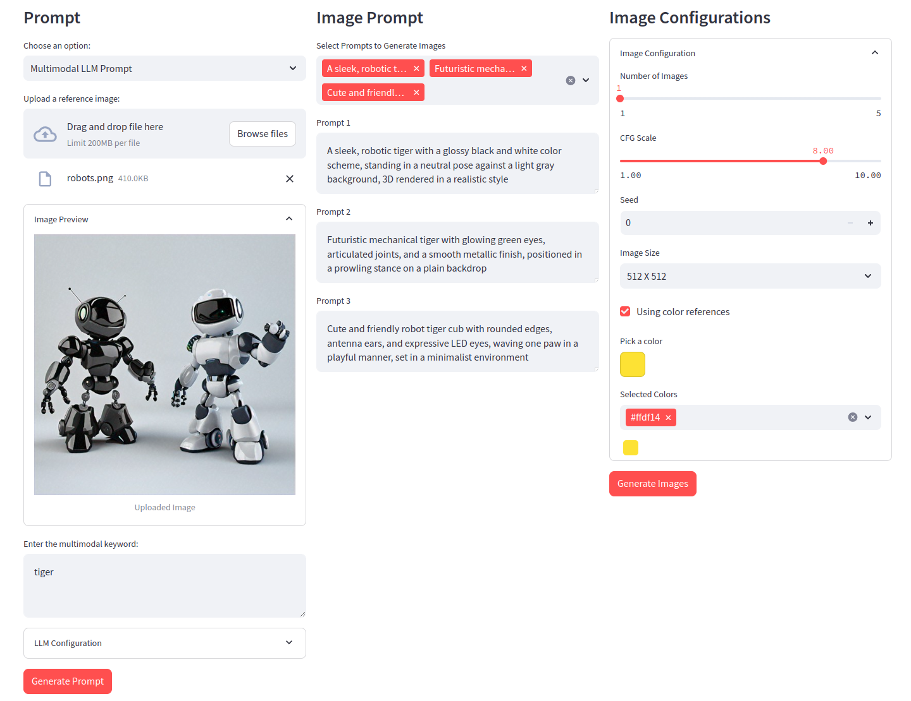
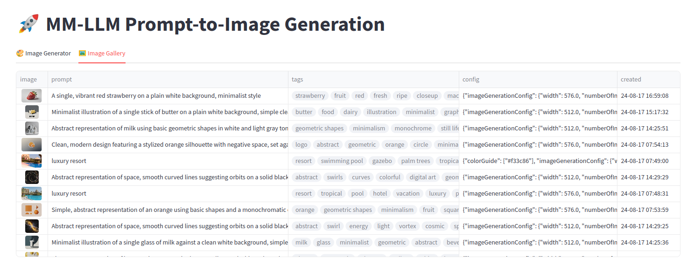

# Titan Image Generation v2

[Amazon Titan Image Generator G1 v2](https://aws.amazon.com/ko/blogs/korea/amazon-titan-image-generator-v2-is-now-available-in-amazon-bedrock/)은 이미지 생성 모델입니다. 이 모델을 활용해 사용자는 참조 이미지 및 색상 팔레트 등 다양한 방식으로 이미지를 생성하고 편집할 수 있습니다. 

### `titan-image-generator-v2.ipynb`

Titan Image Generation v2에서 제공하는 API를 활용한 Text-to-Image, Image Variation, Inpainting, Outpainting, Image Conditioning, Color Conditioning, Background Removal 사용 예시를 포함합니다.

### `multimodal-prompt.ipynb`

Multimodal LLM을 활용하여 이미지 프롬프트를 생성하는 노트북을 포함합니다.

### [Streamlit Demo](https://github.com/hi-space/public-bedrock-image-generator)

위 노트북의 내용을 포함한 Streamlit 데모는 [별도 레포](https://github.com/hi-space/public-bedrock-image-generator)에서 확인할 수 있습니다.

